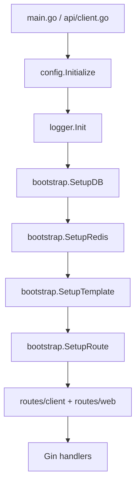
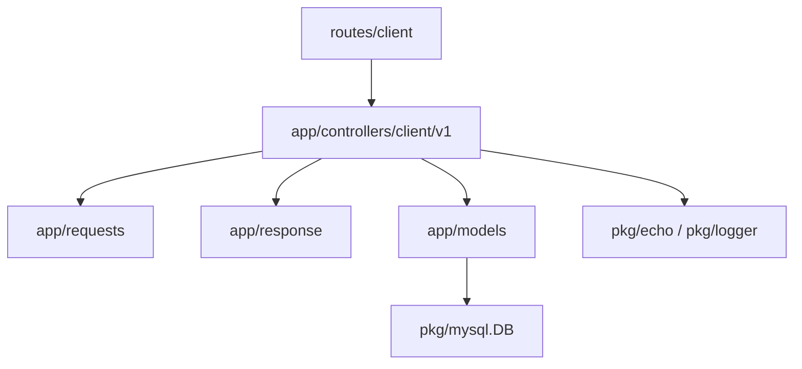
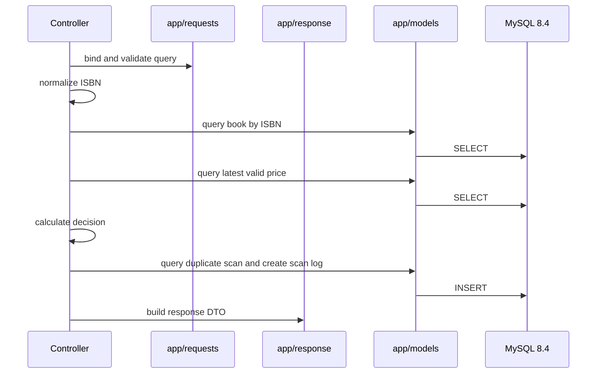

# 二手书扫码回收判断系统后端架构设计

## 1. 现有骨架结论

当前仓库已经初始化为一个可运行的 Gin + GORM Web 项目，不再适合按空项目重建目录。后续二次开发应复用现有骨架，在现有分层内新增二手书回收业务模块。

现有基础能力：

- 双入口：`main.go` 本地运行，`api/client.go` 作为 Vercel Serverless 入口。
- Web 框架：Gin。
- ORM：GORM v2。
- 数据库：MySQL，项目要求使用 MySQL 8.4。
- 配置：Viper，支持 `application.yaml` 本地模式和 `CONFIG` 环境变量模式。
- 日志：Zap，封装在 `pkg/logger`。
- Redis：已封装在 `pkg/redis`，当前中间件会依赖 Redis token。
- 路由：`bootstrap.SetupRoute()` 统一注册 `routes/client` 和 `routes/web`。
- 模型生成：`bin/gormt.go` + `config.yml` 生成 `app/models`。

架构规划原则：

- 保留现有启动、配置、路由、GORM、日志体系。
- 新业务不要改造成另一套全新框架。
- 业务代码按层隔离，避免把扫码回收规则写进 controller 或基础设施包。
- V1 先贴合现有目录，只扩展 controller、request、response、model。
- 数据访问优先使用 GORM 和生成模型，不引入另一套数据访问框架。

## 2. 当前启动链路



说明：

- `main.go` 支持本地独立 HTTP 服务和优雅关闭。
- `api/client.go` 支持 Vercel 部署。
- 两个入口都应复用相同初始化流程。
- 二手书业务只需要接入 `routes/client/route.go` 并新增 controller/request/response/model，不需要重写启动器。

## 3. 目标分层

V1 先采用当前仓库已有的最小骨架，只扩展现有业务目录。



各层职责：

| 层 | 目录 | 职责 |
| --- | --- | --- |
| route | `routes/client` | 注册 URL 和控制器方法 |
| controller | `app/controllers/client/v1` | 解析 Gin 参数、编排 V1 用例、返回响应 |
| request | `app/requests` | 请求参数结构和校验 |
| response | `app/response` | API 响应 DTO |
| model | `app/models` | GORM 模型，由 gormt 或手写维护 |
| pkg | `pkg/*` | 配置、日志、MySQL、Redis 等基础设施 |

后续当扫码判断、批次、人工确认等逻辑明显变复杂时，再按实际重复点抽取公共代码。

## 4. 推荐新增目录

基于当前项目，新增以下目录和文件：

```text
app/
├── controllers/
│   └── client/
│       └── v1/
│           ├── BookController.go
│           └── ScanController.go
├── requests/
│   ├── Book.go
│   └── Scan.go
├── response/
│   ├── Book.go
│   └── Scan.go
└── models/
    ├── Book.go
    ├── PriceSnapshot.go
    └── ScanLog.go
```

说明：

- Go 文件名统一使用驼峰命名，不使用下划线；文档文件名继续小写。
- `app/models` 可以由 gormt 生成，也可以先手写三张 V1 表模型。
- V1 业务编排先放在 controller 内的私有方法或同包辅助函数中，保持方法短小。
- 如果后续逻辑膨胀，再基于真实重复代码抽取公共能力。

## 5. 路由规划

现有 client API 前缀是：

```text
/app/v1
```

因此二手书接口建议挂载为：

| Method | Path | 控制器 |
| --- | --- | --- |
| `GET` | `/app/v1/book/check.json` | `BookController.Check` |
| `GET` | `/app/v1/book/detail.json` | `BookController.Detail` |
| `GET` | `/app/v1/scan/history.json` | `ScanController.History` |

V2 预留：

| Method | Path | 说明 |
| --- | --- | --- |
| `POST` | `/app/v1/scan/batch/create.json` | 创建批次 |
| `POST` | `/app/v1/scan/batch/confirmDuplicate.json` | 确认同 ISBN 多本 |
| `POST` | `/app/v1/scan/batch/submit.json` | 提交批次 |
| `POST` | `/app/v1/book/manualDecision.json` | 人工确认 |
| `GET` | `/app/v1/stat/today.json` | 今日统计 |

`docs/api.md` 已按 `/app/v1` 风格规划，后续实现需保持一致。

## 6. 路由接入方式

在 `routes/client/route.go` 中直接新增 book 和 scan 分组。

目标结构：

```go
book := V1Route.Group("/book")
{
    book.GET("/check.json", clientV1Group.BookController.Check)
    book.GET("/detail.json", clientV1Group.BookController.Detail)
}

scan := V1Route.Group("/scan")
{
    scan.GET("/history.json", clientV1Group.ScanController.History)
}
```

同时需要在 `app/controllers/client/v1/BaseController.go` 的 `Group` 中增加：

```go
BookController
ScanController
```

## 7. 中间件与鉴权策略

当前 `/app/v1` 默认会走 `middlewaresV1.Client()`，除白名单路径外会检查 token。

V1 二手书扫码如果是内部门店工具，建议先作为白名单接口接入，原因：

- 当前登录体系是旧项目 token 逻辑，不一定适合门店小程序。
- V1 重点是跑通扫码判断闭环。
- 后续再设计门店账号和微信登录。

建议在 `app/middlewares/v1/client.go` 的白名单中加入：

```text
/app/v1/book/check.json
/app/v1/book/detail.json
/app/v1/scan/history.json
```

V2 做门店账号后，再移除白名单并接入新登录体系。

## 8. 响应规范

当前项目主要使用 `pkg/echo.Success` 和 `pkg/echo.Error`。

现有成功响应形态：

```json
{
  "code": 1,
  "data": {},
  "msg": "success.",
  "reqId": "..."
}
```

为了贴合现有骨架，二手书 API V1 先沿用 `pkg/echo`，不引入新的响应包。

约定：

- 成功：`echo.Success(c, data, "")`
- 失败：`echo.Error(c, "Failed", msg)` 或补充专用错误码
- `docs/api.md` 已按现有 `code/msg/data/reqId` 响应结构规划。

后续优化：

- 可以统一整理 `pkg/echo` 和 `pkg/output` 两套响应封装。
- 可以新增二手书业务错误码，例如 `InvalidISBN`、`BookNotFound`、`NeedReview`。

## 9. 数据库与模型策略

### 9.1 表名前缀

当前 GORM 连接使用配置项：

```text
database.mysql.prefix
```

并通过 GORM `NamingStrategy.TablePrefix` 自动加表前缀。

因此二手书表需要二选一：

1. 使用项目统一表前缀，例如 `t_book`、`t_price_snapshot`、`t_scan_log`。
2. 在模型 `TableName()` 中返回固定表名，绕过通用前缀。

推荐方案：使用统一表前缀。

原因：

- 符合当前骨架设计。
- 与 gormt 模型生成方式一致。
- 不需要对 GORM 连接做特殊处理。

### 9.2 V1 表

V1 三张表：

- `book`
- `price_snapshot`
- `scan_log`

如果 `DB_PREFIX=t_`，实际表名为：

- `t_book`
- `t_price_snapshot`
- `t_scan_log`

`docs/database.md` 需要同步调整表名。

### 9.3 模型生成

推荐方式：

1. 先在 MySQL 8.4 中创建 V1 表。
2. 修改 `config.yml` 的数据库连接。
3. 设置 `table_names` 为：

```yaml
table_names: "t_book,t_price_snapshot,t_scan_log"
```

4. 运行：

```bash
go run bin/gormt.go
```

5. 检查生成的 `app/models` 文件。

如果 gormt 生成结果不理想，可以手写三张模型，但需要保持 `TableName()` 和 column 常量风格一致。

## 10. V1 控制器编排

V1 先贴合现有骨架，在 controller 中完成薄编排：

- `BookController.Check`：校验 ISBN、查询书籍和最新价格、计算判断结果、写入扫码日志。
- `BookController.Detail`：查询书籍详情和最新价格快照。
- `ScanController.History`：分页查询扫码历史。

controller 中可以使用私有方法拆分 ISBN 归一化、金额转换、判断规则和 GORM 查询，避免单个 handler 过长。

### 10.1 业务流程



## 11. V1 业务规则

### 11.1 ISBN

- 去除空格和横线。
- 校验 ISBN-10。
- 校验 ISBN-13。
- 返回 `normalized_isbn`。

### 11.2 Money

规则：

- 数据库金额字段统一使用 `decimal(20,2)`。
- 业务层使用 `github.com/shopspring/decimal.Decimal` 处理金额。
- API 输出人民币元。

### 11.3 Decision

枚举：

- `ACCEPT`
- `REJECT`
- `NEED_REVIEW`

### 11.4 RecycleRule

V1 判断规则：

| 条件 | 结果 |
| --- | --- |
| ISBN 不合法 | 参数错误 |
| 无书籍数据 | `REJECT` |
| 有书籍数据 | `ACCEPT` |
| 有书籍数据且有均价 | `ACCEPT`，同时计算建议回收价 |

建议回收价：

```text
avg_price * 30 / 100
```

## 12. 复杂度控制

当出现以下情况时，再抽取公共业务代码：

- controller 中同一段业务编排被多个接口复用。
- 扫码判断规则超过单个 controller 私有方法可维护范围。
- 批量扫码、人工确认、门店账号开始共享同一组业务流程。

抽取时以现有目录风格为准，先解决真实重复和可维护性问题。

## 13. 配置规划

继续使用现有配置体系。

### 13.1 application.yaml

需要确认：

```yaml
DB_CONNECTION: mysql
DB_HOST: 127.0.0.1
DB_PORT: 3306
DB_DATABASE: kfz
DB_USERNAME: root
DB_PASSWORD: your_password
DB_PREFIX: t_
```

### 13.2 config.yml

用于 gormt 生成模型：

```yaml
table_prefix: "-t_"
table_names: "t_book,t_price_snapshot,t_scan_log"
```

说明：

- `table_prefix: "-t_"` 表示生成结构体时去掉 `t_` 前缀。
- 如果希望结构体名保留前缀，可不设置去前缀。

## 14. 与现有功能的隔离边界

二手书业务不应修改：

- web 页面相关代码，当前项目要求保留 web。
- 旧 token 登录逻辑，除非明确做门店账号。
- `pkg/mysql` 的全局连接方式。
- `bootstrap` 启动流程。

允许新增：

- 新 controller。
- 新 route group。
- 新 request/response DTO。
- 新模型文件。
- 新迁移和 seed 文档或 SQL。

## 15. 测试策略

### 15.1 业务规则测试

覆盖：

- ISBN 合法和非法。
- ISBN 归一化。
- 金额按十进制定点口径输出。
- 回收规则所有分支。

### 15.2 model/GORM 测试

使用 MySQL 8.4 测试库。

覆盖：

- 查书籍。
- 查最新有效价格快照。
- `client_request_id` 幂等。
- 插入扫码日志。
- 查询历史分页。

### 15.3 controller 测试

使用 Gin httptest。

覆盖：

- 正常参数。
- 非法 ISBN。
- 缺少参数。
- 响应结构和 `reqId`。

## 16. 开发顺序

1. 同步 `docs/api.md` 和 `docs/database.md` 到现有 `/app/v1` 路由和 `t_` 表前缀。
2. 创建 MySQL 8.4 V1 表。
3. 用 gormt 生成或手写 `app/models` 中的模型。
4. 新增 `app/requests` 和 `app/response` 中的 V1 DTO。
5. 新增 `BookController` 和 `ScanController`。
6. 在 `routes/client/route.go` 注册 `/app/v1` 路由。
7. 在中间件白名单中放行 V1 扫码接口。
8. 联调用 mock seed 数据验证。

## 17. 文档一致性要求

当前规划文档需要保持以下约束：

- `docs/api.md` 使用 `/app/v1` 接口前缀，响应结构使用 `code/msg/data/reqId`。
- `docs/database.md` 使用 `book`、`price_snapshot`、`scan_log` 逻辑表名，并说明实际物理表名受 `DB_PREFIX` 影响。
- `docs/data_model.md` 使用 `book`、`price_snapshot`、`scan_log` 作为 V1 核心模型。

## 18. 待确认问题

- V1 扫码接口是否先加入 token 白名单。
- 数据库表是否统一使用 `t_` 前缀。
- 模型是 gormt 生成还是手写。
- 是否继续保留 Vercel 部署能力，还是只做本地/服务器常驻服务。
- 旧示例控制器是否后续清理。
