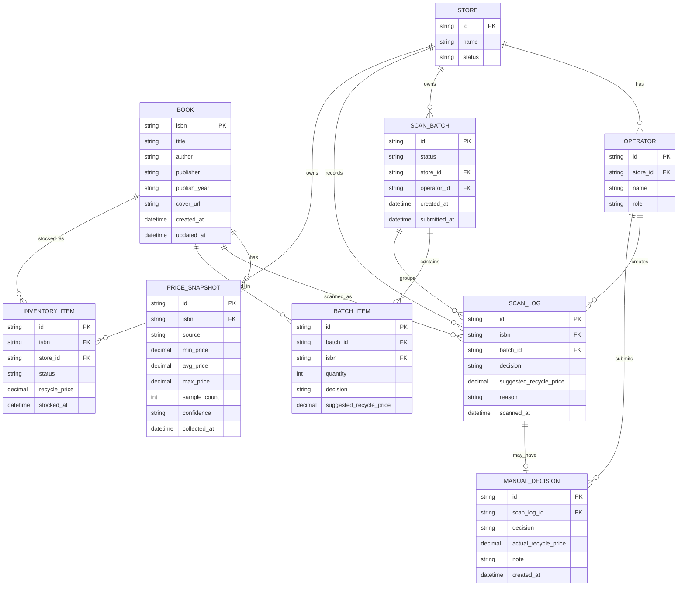

# 二手书扫码回收判断系统数据模型设计

## 1. 设计目标

本数据模型服务于“扫码 ISBN 判断是否回收”的核心链路，并为后续批量扫码、人工确认、门店账号、库存入库和标签打印预留扩展空间。

核心原则：

- 书籍品种按 ISBN 去重。
- 每一次扫码都新增扫码日志，不覆盖历史。
- 同一批次内相同 ISBN 可以聚合为数量，也可以保留扫码明细。
- 价格数据使用快照，不在每次扫码时实时依赖外部采集。
- V1 优先保证扫码判断闭环，V2/V3 再扩展门店、账号、库存和订单。

## 2. 领域对象关系



## 3. V1 必需模型

### 3.1 book

书籍基础信息表。表示“一种书”，按 ISBN 唯一。

| 字段 | 类型 | 必填 | 说明 |
| --- | --- | --- | --- |
| isbn | varchar(20) | 是 | ISBN，主键，建议存归一化后的 10 位或 13 位 |
| title | varchar(255) | 是 | 书名 |
| author | varchar(255) | 否 | 作者 |
| publisher | varchar(255) | 否 | 出版社 |
| publish_year | varchar(20) | 否 | 出版年份 |
| cover_url | varchar(1000) | 否 | 封面地址 |
| source | varchar(50) | 否 | 数据来源，如 `manual`、`mock`、`external` |
| created_at | datetime | 是 | 创建时间 |
| updated_at | datetime | 是 | 更新时间 |

约束：

- `isbn` 唯一。
- 同一本 ISBN 重复扫码时不重复创建 `book`。
- 书籍信息更新不影响历史扫码日志中已保存的判断结果。

### 3.2 price_snapshot

价格快照表。表示某个时间点从某个来源得到的二手价格参考。

| 字段 | 类型 | 必填 | 说明 |
| --- | --- | --- | --- |
| id | varchar(36) | 是 | 主键 |
| isbn | varchar(20) | 是 | 关联 `book.isbn` |
| source | varchar(50) | 是 | 价格来源，如 `local_mock`、`manual`、`kongfz` |
| min_price | decimal(10,2) | 否 | 最低价 |
| avg_price | decimal(10,2) | 否 | 平均价 |
| max_price | decimal(10,2) | 否 | 最高价 |
| sample_count | int | 是 | 有效样本数 |
| confidence | varchar(20) | 是 | 数据可信度：`HIGH`、`MEDIUM`、`LOW`、`NONE` |
| raw_url | varchar(1000) | 否 | 来源链接 |
| raw_payload_ref | varchar(255) | 否 | 原始数据存储引用，V1 可为空 |
| collected_at | datetime | 是 | 采集或录入时间 |
| expires_at | datetime | 否 | 价格快照过期时间 |
| created_at | datetime | 是 | 创建时间 |

约束：

- 价格数据不覆盖历史，新增快照为主。
- 判断接口默认使用同 ISBN 最新且未过期的快照。
- V1 可以只使用 `local_mock` 或 `manual` 来源。

### 3.3 scan_log

扫码日志表。表示一次扫码行为。

| 字段 | 类型 | 必填 | 说明 |
| --- | --- | --- | --- |
| id | varchar(36) | 是 | 主键 |
| isbn | varchar(20) | 是 | 扫描到的 ISBN |
| normalized_isbn | varchar(20) | 是 | 归一化后的 ISBN |
| batch_id | varchar(36) | 否 | 所属批次，V1 可为空 |
| store_id | varchar(36) | 否 | 门店 ID，V2 使用 |
| operator_id | varchar(36) | 否 | 操作员 ID，V2 使用 |
| decision | varchar(20) | 是 | 系统判断：`ACCEPT`、`REJECT`、`NEED_REVIEW` |
| reason | varchar(500) | 是 | 判断原因 |
| market_min_price | decimal(10,2) | 否 | 判断时使用的最低价 |
| market_avg_price | decimal(10,2) | 否 | 判断时使用的平均价 |
| market_max_price | decimal(10,2) | 否 | 判断时使用的最高价 |
| market_sample_count | int | 否 | 判断时使用的样本数 |
| suggested_recycle_price | decimal(10,2) | 否 | 建议回收价 |
| confidence | varchar(20) | 是 | 判断时的数据可信度 |
| price_snapshot_id | varchar(36) | 否 | 使用的价格快照 ID |
| duplicate_recently | bool | 是 | 是否近期扫过同 ISBN |
| duplicate_in_batch | bool | 是 | 是否当前批次重复 |
| client_request_id | varchar(64) | 否 | 小程序请求幂等 ID |
| scanned_at | datetime | 是 | 扫码时间 |
| created_at | datetime | 是 | 创建时间 |

约束：

- 每次扫码新增一条 `scan_log`。
- 不因为同 ISBN 重复扫码覆盖旧日志。
- `decision` 和价格字段保存当时判断快照，避免后续规则变化导致历史记录失真。
- `client_request_id` 用于防止小程序网络重试造成重复写入，V1 可选。

## 4. V2 批量扫码与人工确认模型

### 4.1 scan_batch

扫码批次表。表示一次连续扫码任务。

| 字段 | 类型 | 必填 | 说明 |
| --- | --- | --- | --- |
| id | varchar(36) | 是 | 主键 |
| store_id | varchar(36) | 否 | 门店 ID |
| operator_id | varchar(36) | 否 | 操作员 ID |
| status | varchar(20) | 是 | `DRAFT`、`SUBMITTED`、`CANCELLED` |
| total_count | int | 是 | 总数量 |
| accept_count | int | 是 | 可收数量 |
| reject_count | int | 是 | 不收数量 |
| review_count | int | 是 | 需人工确认数量 |
| estimated_total_price | decimal(10,2) | 是 | 预计总回收价 |
| created_at | datetime | 是 | 创建时间 |
| submitted_at | datetime | 否 | 提交时间 |
| updated_at | datetime | 是 | 更新时间 |

约束：

- 一个批次包含多个 `batch_item`。
- 批次提交后原则上不再修改明细；如需修改，后续应设计调整记录。

### 4.2 batch_item

批次明细表。按批次和 ISBN 聚合数量。

| 字段 | 类型 | 必填 | 说明 |
| --- | --- | --- | --- |
| id | varchar(36) | 是 | 主键 |
| batch_id | varchar(36) | 是 | 关联 `scan_batch.id` |
| isbn | varchar(20) | 是 | 关联 `book.isbn` |
| title | varchar(255) | 否 | 冗余书名，便于列表展示 |
| quantity | int | 是 | 本批次同 ISBN 数量 |
| decision | varchar(20) | 是 | 当前聚合判断结果 |
| reason | varchar(500) | 是 | 判断原因 |
| suggested_recycle_price | decimal(10,2) | 否 | 单本建议回收价 |
| subtotal_price | decimal(10,2) | 否 | 小计价格 |
| first_scan_log_id | varchar(36) | 否 | 首次扫码日志 |
| last_scan_log_id | varchar(36) | 否 | 最近扫码日志 |
| created_at | datetime | 是 | 创建时间 |
| updated_at | datetime | 是 | 更新时间 |

约束：

- 建议唯一索引：`batch_id + isbn`。
- 同批次重复扫同 ISBN 时，默认提示用户确认。
- 用户确认“还有一本相同书”后，`quantity + 1`。
- 用户选择忽略时，只保留 `scan_log`，不增加 `batch_item.quantity`。

### 4.3 manual_decision

人工确认表。记录操作员对 `NEED_REVIEW` 或异常结果的人工决策。

| 字段 | 类型 | 必填 | 说明 |
| --- | --- | --- | --- |
| id | varchar(36) | 是 | 主键 |
| scan_log_id | varchar(36) | 是 | 关联扫码日志 |
| batch_item_id | varchar(36) | 否 | 关联批次明细 |
| isbn | varchar(20) | 是 | 冗余 ISBN |
| operator_id | varchar(36) | 否 | 操作员 ID |
| manual_decision | varchar(20) | 是 | `ACCEPT` 或 `REJECT` |
| actual_recycle_price | decimal(10,2) | 否 | 实际回收价 |
| note | varchar(1000) | 否 | 备注 |
| created_at | datetime | 是 | 创建时间 |

约束：

- 一个 `scan_log` 最多一条有效人工确认。
- 人工确认不改写原始系统判断，保留系统判断和人工判断两套结果。

## 5. V2 账号与门店模型

### 5.1 store

门店表。

| 字段 | 类型 | 必填 | 说明 |
| --- | --- | --- | --- |
| id | varchar(36) | 是 | 主键 |
| name | varchar(100) | 是 | 门店名称 |
| code | varchar(50) | 否 | 门店编码 |
| status | varchar(20) | 是 | `ACTIVE`、`DISABLED` |
| created_at | datetime | 是 | 创建时间 |
| updated_at | datetime | 是 | 更新时间 |

### 5.2 operator

操作员表。

| 字段 | 类型 | 必填 | 说明 |
| --- | --- | --- | --- |
| id | varchar(36) | 是 | 主键 |
| store_id | varchar(36) | 是 | 关联门店 |
| name | varchar(100) | 是 | 操作员姓名 |
| mobile | varchar(30) | 否 | 手机号 |
| openid | varchar(128) | 否 | 微信 openid |
| role | varchar(30) | 是 | `OPERATOR`、`STORE_ADMIN`、`SYSTEM_ADMIN` |
| status | varchar(20) | 是 | `ACTIVE`、`DISABLED` |
| created_at | datetime | 是 | 创建时间 |
| updated_at | datetime | 是 | 更新时间 |

## 6. V3 库存模型

### 6.1 inventory_item

库存实体书表。表示“具体一本书”，不是书籍品种。

| 字段 | 类型 | 必填 | 说明 |
| --- | --- | --- | --- |
| id | varchar(36) | 是 | 主键，库存 ID |
| isbn | varchar(20) | 是 | 关联 `book.isbn` |
| store_id | varchar(36) | 是 | 所属门店 |
| source_scan_log_id | varchar(36) | 否 | 来源扫码日志 |
| source_batch_id | varchar(36) | 否 | 来源批次 |
| status | varchar(30) | 是 | `IN_STOCK`、`LISTED`、`SOLD`、`DISCARDED` |
| recycle_price | decimal(10,2) | 否 | 实际回收价 |
| label_code | varchar(100) | 否 | 标签码 |
| stocked_at | datetime | 是 | 入库时间 |
| updated_at | datetime | 是 | 更新时间 |

约束：

- 一本实体书一条 `inventory_item`。
- 同 ISBN 的多本书对应多条 `inventory_item`。
- 只有进入库存管理阶段才创建该表数据，V1/V2 可不创建。

## 7. 枚举定义

### 7.1 decision

| 值 | 说明 |
| --- | --- |
| `ACCEPT` | 建议回收 |
| `REJECT` | 不建议回收 |
| `NEED_REVIEW` | 需要人工确认 |

### 7.2 confidence

| 值 | 说明 |
| --- | --- |
| `HIGH` | 样本数充足，价格稳定 |
| `MEDIUM` | 有价格数据，但样本一般 |
| `LOW` | 样本少、价格异常或数据偏旧 |
| `NONE` | 无有效价格数据 |

### 7.3 batch_status

| 值 | 说明 |
| --- | --- |
| `DRAFT` | 批次草稿 |
| `SUBMITTED` | 已提交 |
| `CANCELLED` | 已取消 |

### 7.4 source

| 值 | 说明 |
| --- | --- |
| `mock` | 测试数据 |
| `manual` | 人工录入 |
| `local_mock` | 本地 mock 价格 |
| `kongfz` | 孔夫子来源，后续启用 |
| `external` | 其他外部来源 |

## 8. 重复扫码处理规则

### 8.1 普通扫码

同一本 ISBN 在普通扫码页重复扫描：

- `book` 不重复创建。
- `price_snapshot` 优先复用最新有效快照。
- `scan_log` 每次新增。
- 小程序可根据 `duplicate_recently` 提示“该书刚刚扫过”。

### 8.2 批量扫码

同一批次内重复扫描同 ISBN：

- 后端先写入新的 `scan_log`。
- 如果 `batch_item` 不存在，创建 `quantity = 1`。
- 如果 `batch_item` 已存在，返回 `duplicate_in_batch = true`。
- 小程序提示用户确认。
- 用户确认还有一本相同书时，`batch_item.quantity + 1`。
- 用户选择忽略时，不修改 `batch_item.quantity`。

### 8.3 库存入库

进入库存阶段后：

- ISBN 仍然表示书籍品种。
- 库存 ID 表示一本实体书。
- 同 ISBN 的多本书应创建多条 `inventory_item`。

## 9. 建议索引

| 表 | 索引 | 说明 |
| --- | --- | --- |
| book | unique(`isbn`) | ISBN 去重 |
| price_snapshot | index(`isbn`, `collected_at`) | 查询最新价格快照 |
| scan_log | index(`normalized_isbn`, `scanned_at`) | 查询重复扫码和历史记录 |
| scan_log | index(`batch_id`, `created_at`) | 查询批次扫码明细 |
| scan_log | unique(`client_request_id`) | 防止请求重试重复写入，字段为空时不参与 |
| scan_batch | index(`store_id`, `created_at`) | 门店批次查询 |
| batch_item | unique(`batch_id`, `isbn`) | 同批次同 ISBN 聚合 |
| manual_decision | unique(`scan_log_id`) | 一次扫码最多一个有效人工确认 |
| inventory_item | index(`isbn`, `store_id`) | 库存查询 |

## 10. V1 最小落库建议

如果第一阶段只做最小可用版，建议先建三张表：

- `book`
- `price_snapshot`
- `scan_log`

V1 可以暂不建：

- `scan_batch`
- `batch_item`
- `manual_decision`
- `store`
- `operator`
- `inventory_item`

但 V1 的 `scan_log` 需要预留 `batch_id`、`store_id`、`operator_id`、`duplicate_in_batch` 等字段，避免后续迁移成本过高。

## 11. app/models 约定

当前 Go 项目使用 GORM，并通过 `bin/gormt.go` + `config.yml` 生成 `app/models`。

V1 建议生成或手写以下模型：

- `Book`
- `PriceSnapshot`
- `ScanLog`

如果 `DB_PREFIX=t_`，对应物理表名为：

- `t_book`
- `t_price_snapshot`
- `t_scan_log`

如果使用 gormt，建议配置：

```yaml
table_prefix: "-t_"
table_names: "t_book,t_price_snapshot,t_scan_log"
```

如果手写模型，需要保持当前项目风格：

- 每个模型实现 `TableName()`。
- 每个模型提供 Columns 常量结构。
- 字段 tag 同时包含 `gorm:"column:..."` 和 JSON tag。

## 12. 待确认问题

- V1 数据库使用 MySQL 8.4。
- ISBN 是否统一保存 ISBN-13，ISBN-10 是否转换。
- 无价格数据时默认 `REJECT` 还是 `NEED_REVIEW`。
- 价格快照默认有效期是 7 天、30 天还是手动刷新。
- `client_request_id` 是否由小程序生成。
- V2 批次提交后是否允许撤销或修改。
