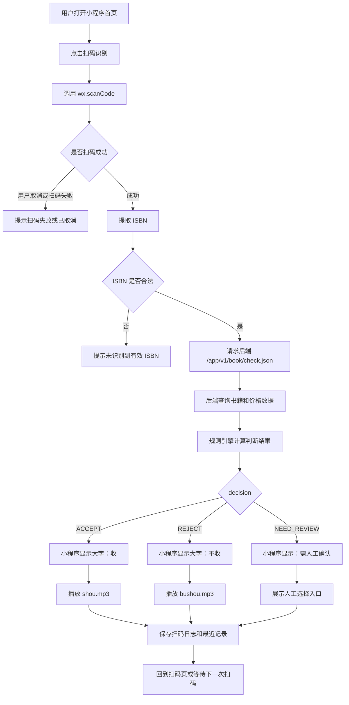
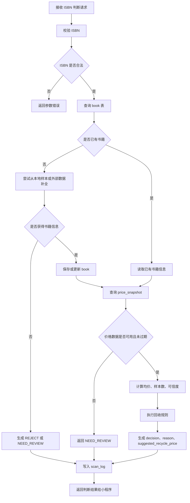
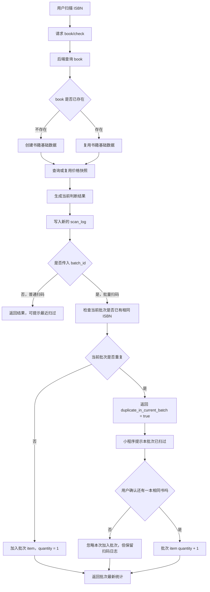
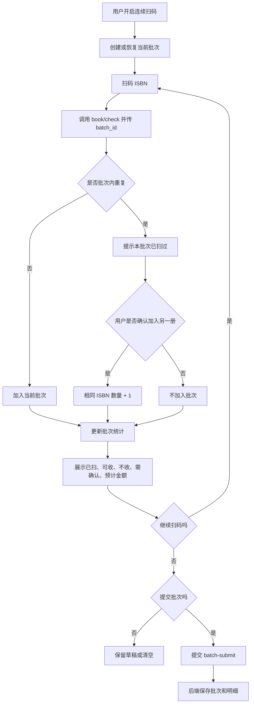
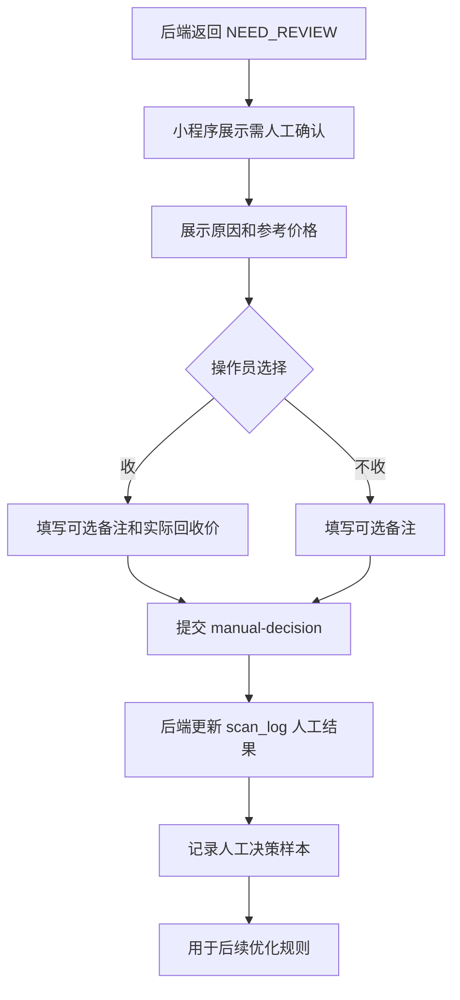
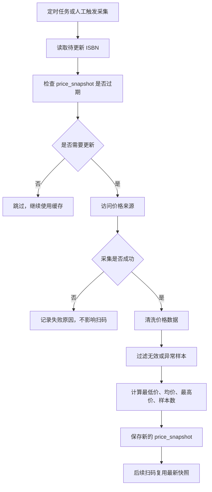
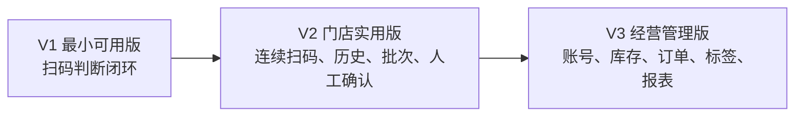

# 二手书扫码回收判断系统 PRD

## 1. 项目概述

### 1.1 项目背景

二手书回收门店在现场收书时，需要快速判断一本书是否值得回收。传统方式依赖人工经验或临时查询二手平台价格，效率低、判断不稳定，也难以沉淀门店扫码记录和价格规则。

本项目希望建设一个面向门店回收人员的扫码判断系统。工作人员通过微信小程序扫描书籍 ISBN 条形码，系统根据书籍基础信息、二手市场价格、回收规则和数据可信度，快速返回“收”“不收”或“需人工确认”的判断结果。

### 1.2 产品定位

面向旧书回收门店和回收人员的移动端扫码判断工具。

核心目标不是展示复杂书籍信息，而是在现场高频扫码场景下，用最短路径给出清晰结论。

### 1.3 产品目标

- 让门店人员通过扫码快速判断一本书是否回收。
- 降低人工查询二手价格和人工判断的成本。
- 将扫码、判断、价格、原因和人工确认结果沉淀为数据。
- 为后续门店统计、库存入库、标签打印和经营分析打基础。

### 1.4 非目标

V1 不做完整库存系统、销售系统、员工绩效系统、财务结算系统。

V1 不追求复杂视觉设计，不做重运营后台，不做多平台价格聚合的完整闭环。

## 2. 用户与使用场景

### 2.1 目标用户

| 用户 | 描述 | 核心诉求 |
| --- | --- | --- |
| 门店回收人员 | 在现场扫描大量旧书 | 快速知道收不收、多少钱收 |
| 门店管理员 | 关注当日回收情况 | 查看扫码记录、统计可收数量和预计金额 |
| 系统管理员 | 维护规则和数据源 | 配置回收规则、检查异常数据 |

### 2.2 核心场景

门店人员面对一批旧书，逐本扫描 ISBN。系统在 1-2 秒内返回结果：

- 可以回收：显示大字“收”，播放“收”的语音，展示建议回收价。
- 不建议回收：显示大字“不收”，播放“不收”的语音，展示拒收原因。
- 数据不足或价格异常：显示“需人工确认”，允许人工选择收或不收并填写备注。

### 2.3 核心用户旅程

1. 用户打开微信小程序。
2. 点击“扫码识别”。
3. 小程序调用 `wx.scanCode` 扫描 ISBN。
4. 小程序校验 ISBN 格式。
5. 小程序请求后端判断接口。
6. 后端查询书籍信息和价格数据。
7. 后端根据规则返回判断结果。
8. 小程序展示“收 / 不收 / 需人工确认”。
9. 小程序播放对应语音并记录本次扫码。
10. 如果开启连续扫码，则短暂停留后进入下一次扫码。

## 3. 业务流程图

### 3.1 V1 核心扫码判断流程



### 3.2 后端判断与数据流转流程



### 3.3 同一本书重复扫码流程

同一本书重复扫码时，系统需要区分“重复操作”和“确实有多本相同书”。原则是书籍数据按 ISBN 去重，扫码行为按次数记录。



### 3.4 批量扫码流程



### 3.5 人工确认流程



### 3.6 数据采集与价格快照流程

V1 优先使用 mock 数据或人工样本；真实采集作为后续能力，不阻塞扫码主链路。



### 3.7 版本演进路线



## 4. 版本规划

### 4.1 V1 最小可用版

目标：跑通现场扫码判断闭环。

功能范围：

- 微信小程序扫码 ISBN。
- ISBN 格式校验。
- 后端判断接口。
- 书籍基础信息展示。
- 判断结果展示：`ACCEPT`、`REJECT`、`NEED_REVIEW`。
- 建议回收价展示。
- 判断原因展示。
- “收 / 不收”语音播报。
- 最近扫码记录本地缓存。
- 后端保存扫码日志。
- 后端先支持 mock 数据和手动录入数据，真实采集可后置。

### 4.2 V2 门店实用版

目标：支持连续扫码和门店日常使用。

功能范围：

- 连续扫码模式。
- 批量扫码列表。
- 批次提交。
- 历史扫码记录。
- 人工确认提交。
- 今日统计。
- 基础门店和操作员信息。

### 4.3 V3 经营管理版

目标：从扫码工具扩展为门店回收管理系统。

功能范围：

- 门店账号和员工账号。
- 回收订单。
- 库存入库。
- 标签打印。
- 数据统计报表。
- 员工绩效统计。
- 多数据源价格聚合。

## 5. 功能需求

### 5.1 小程序首页 / 扫码页

首页是 V1 的主工作台。

页面元素：

- 系统名称：二手书扫码回收。
- 主按钮：扫码识别。
- 连续扫码开关，V1 可先隐藏或置灰。
- 语音播报开关。
- 最近一次扫码结果。
- 历史记录入口，V1 可先进入本地最近记录。
- 设置入口。

扫码逻辑：

- 点击扫码按钮后调用 `wx.scanCode`。
- 扫码成功后提取 ISBN。
- ISBN 不合法时提示“未识别到有效 ISBN”。
- ISBN 合法时请求后端判断接口。
- 请求过程中按钮进入 loading 状态并防重复点击。
- 返回结果后展示结果弹窗或结果区域。

### 5.2 扫码结果展示

结果状态：

| 状态 | 含义 | 小程序展示 |
| --- | --- | --- |
| `ACCEPT` | 建议回收 | 大字“收”，绿色状态，播放 `shou.mp3` |
| `REJECT` | 不建议回收 | 大字“不收”，红色或灰色状态，播放 `bushou.mp3` |
| `NEED_REVIEW` | 需要人工确认 | 橙色状态，展示“收 / 不收”人工按钮 |

结果字段：

- ISBN
- 书名
- 作者
- 出版社
- 参考二手价格
- 建议回收价
- 判断结果
- 判断原因
- 数据可信度
- 数据更新时间

### 5.3 书籍详情页

用于查看一次扫码的完整信息。

展示字段：

- ISBN
- 书名
- 作者
- 出版社
- 出版年份
- 封面图片，如有
- 价格来源
- 最低价
- 平均价
- 最高价
- 有效样本数
- 建议回收价
- 判断结果
- 判断原因
- 数据更新时间

操作：

- 重新查询。
- 返回扫码页。

### 5.4 历史记录

V1 可先支持本地最近记录，V2 接入后端记录。

筛选条件：

- 全部
- 只看收
- 只看不收
- 需人工确认

列表字段：

- 扫码时间
- ISBN
- 书名
- 判断结果
- 建议回收价

### 5.5 连续扫码模式

V2 实现。

功能：

- 用户开启连续扫码后，每次扫码完成自动回到扫码状态。
- 每次结果加入当前批次。
- 批次展示已扫数量、可收数量、不收数量、需人工确认数量、预计总回收价。
- 支持继续扫码、提交批次、清空批次。

### 5.6 人工确认

当后端返回 `NEED_REVIEW` 时，小程序展示人工确认操作。

用户可选择：

- 收
- 不收

可填写：

- 备注
- 实际回收价，V2 可选

提交后后端保存人工结果，用于后续优化规则。

### 5.7 设置页

设置项：

- 语音播报开关。
- 震动提醒开关。
- 连续扫码开关。
- 是否显示价格详情。
- 操作员信息，V2。
- 门店信息，V2。

## 6. UI 与交互要求

### 6.1 UI 框架

微信小程序端采用有赞 Vant Weapp 组件库。

使用要求：

- 基础按钮使用 `van-button`。
- 结果弹窗使用 `van-dialog` 或 `van-popup`。
- 状态标签使用 `van-tag`。
- 书籍信息使用 `van-card`、`van-cell-group`、`van-cell`。
- 设置项使用 `van-switch`、`van-cell`。
- 历史列表使用 `van-tabs`、`van-cell`、`van-empty`。
- loading 和错误提示使用 `van-toast` 或 `van-loading`。

### 6.2 设计原则

- 现场优先：扫码按钮和判断结果必须醒目。
- 信息分层：先显示收不收，再显示价格和原因。
- 操作路径短：扫码后尽量不需要二次操作。
- 高对比：收、不收、需人工确认三种状态颜色明确。
- 弱网友好：请求中、失败、超时都要有明确提示。

### 6.3 Figma 原型要求

第一阶段只做低保真原型。

必须画：

- 首页扫码页。
- 收结果状态。
- 不收结果状态。
- 需人工确认状态。
- 查询失败状态。

建议画：

- 批量扫码页。
- 历史记录页。
- 书籍详情页。
- 设置页。

暂不画：

- 登录页。
- 门店管理页。
- 员工管理页。
- 库存管理页。
- 标签打印页。

## 7. 后端需求

### 7.1 后端定位

后端负责书籍信息查询、价格数据管理、回收规则判断、扫码日志保存和对小程序提供 API。

### 7.2 核心模块

- API 服务模块。
- 书籍信息模块。
- 价格数据模块。
- 回收规则模块。
- 扫码日志模块。
- 人工确认模块。
- 数据采集模块，V1 可先不接真实采集。

### 7.3 判断逻辑

后端接收到 ISBN 后，按以下顺序处理：

1. 校验 ISBN。
2. 查询本地书籍数据。
3. 查询本地价格数据。
4. 判断数据是否充足。
5. 计算参考二手价格。
6. 根据规则计算建议回收价。
7. 返回判断结果和原因。
8. 保存扫码日志。

### 7.4 初始回收规则

V1 建议使用可配置的简单规则：

- 无书籍数据：返回 `REJECT` 或 `NEED_REVIEW`，默认建议 `REJECT`。
- 无价格数据：返回 `NEED_REVIEW`。
- 有效价格样本数低于 3：返回 `NEED_REVIEW`。
- 二手均价低于 10 元：返回 `REJECT`。
- 二手均价大于等于 10 元：返回 `ACCEPT`。
- 建议回收价 = 二手均价 * 30%，结果保留 1 位小数。
- 价格异常值需要在后续版本过滤，V1 可先人工复核。

以上规则是 V1 默认值，后续应改为后台可配置。

## 8. 数据需求

### 8.1 书籍数据

字段：

- ISBN
- 书名
- 作者
- 出版社
- 出版年份
- 封面图片
- 创建时间
- 更新时间

### 8.2 价格数据

字段：

- ISBN
- 来源平台
- 最低价
- 最高价
- 平均价
- 样本数
- 采集时间
- 原始链接，可选
- 数据可信度

### 8.3 扫码日志

字段：

- 日志 ID
- ISBN
- 书名
- 判断结果
- 判断原因
- 建议回收价
- 操作员 ID，V2
- 门店 ID，V2
- 扫码时间
- 是否人工确认
- 人工确认结果

## 9. API 需求

### 9.1 扫码判断接口

`GET /app/v1/book/check.json?isbn={isbn}`

用途：扫码后立即判断是否回收。

响应示例：

```json
{
  "code": 1,
  "msg": "success.",
  "reqId": "0b8c0a8e-8d24-49d4-bdf7-52f80dd0d91a",
  "data": {
    "isbn": "9787111128069",
    "title": "示例书名",
    "author": "示例作者",
    "publisher": "示例出版社",
    "publish_year": "2018",
    "decision": "ACCEPT",
    "reason": "二手市场均价满足回收规则",
    "market_price": {
      "min": 18.0,
      "avg": 24.5,
      "max": 39.0,
      "sample_count": 8,
      "source": "local_mock"
    },
    "suggested_recycle_price": 7.4,
    "confidence": "HIGH",
    "updated_at": "2026-06-30T10:00:00+08:00"
  }
}
```

### 9.2 书籍详情接口

`GET /app/v1/book/detail.json?isbn={isbn}`

用途：查看书籍完整信息和价格来源。

### 9.3 扫码历史接口

`GET /app/v1/scan/history.json?page=1&page_size=20&decision=ACCEPT`

用途：查询扫码历史记录。

### 9.4 批量提交接口

`POST /app/v1/scan/batch/submit.json`

用途：提交连续扫码批次。

### 9.5 人工确认接口

`POST /app/v1/book/manualDecision.json`

用途：提交人工选择的收或不收。

### 9.6 今日统计接口

`GET /app/v1/stat/today.json`

用途：查询今日扫码统计，V2 实现。

## 10. 数据采集策略

### 10.1 V1 策略

V1 不直接依赖实时采集。优先使用：

- 手动维护的测试书籍数据。
- 本地 mock 价格数据。
- 少量真实样本数据。

这样可以先验证小程序扫码、后端判断和门店工作流。

### 10.2 后续采集策略

如需采集孔夫子旧书网或其他平台价格，需要单独设计采集方案：

- 确认目标网站服务条款和数据使用边界。
- 控制访问频率。
- 使用缓存避免重复请求。
- 保存采集时间和来源。
- 对异常价格做过滤。
- 采集失败时不影响扫码主流程。

### 10.3 数据可信度

数据可信度建议分为：

| 等级 | 条件 |
| --- | --- |
| `HIGH` | 样本数充足，价格分布稳定 |
| `MEDIUM` | 有价格数据，但样本数一般 |
| `LOW` | 样本少、价格异常或数据过期 |
| `NONE` | 无有效价格数据 |

## 11. 异常处理

小程序需要处理：

- 用户取消扫码。
- 扫码失败。
- ISBN 格式错误。
- 网络请求失败。
- 后端服务异常。
- 接口超时。
- 无书籍数据。
- 无价格数据。
- 音频播放失败。

提示文案：

- 未识别到有效 ISBN。
- 网络异常，请稍后重试。
- 查询失败，请重新扫码。
- 系统暂无该书数据，默认不收。
- 数据不足，需要人工确认。

## 12. 权限与账号

V1 可不做登录，但需要预留操作员和门店字段。

V2 建议支持：

- 微信授权登录。
- 操作员账号。
- 门店管理员账号。
- 系统管理员账号。

权限边界：

- 操作员：扫码、查看自己的记录。
- 门店管理员：查看门店记录和统计。
- 系统管理员：配置规则、查看全部数据。

## 13. 验收标准

### 13.1 V1 功能验收

- 用户可以在小程序点击扫码按钮并扫描 ISBN。
- ISBN 合法时可以调用后端判断接口。
- ISBN 不合法时显示错误提示。
- 后端可以返回 `ACCEPT`、`REJECT`、`NEED_REVIEW` 三种结果。
- 小程序可以根据结果展示对应状态。
- `ACCEPT` 播放“收”的语音。
- `REJECT` 播放“不收”的语音。
- 请求中按钮不可重复点击。
- 最近扫码结果可以展示。
- 后端可以保存扫码日志。

### 13.2 性能验收

- mock 数据场景下，扫码判断接口响应时间小于 500ms。
- 小程序从扫码完成到展示结果，正常网络下小于 2 秒。
- 接口超时后有明确错误提示。

### 13.3 体验验收

- “收 / 不收”状态在门店环境中一眼可见。
- 价格和原因不遮挡主要判断结果。
- 弱网、失败、取消扫码都有明确反馈。

## 14. 项目里程碑

### 14.1 第 1 周：需求和原型

- 完成 PRD。
- 完成低保真 Figma。
- 确定 V1 接口响应结构。
- 确定 V1 判断规则。

### 14.2 第 2 周：后端 V1

- 搭建 Go API 服务。
- 实现 `/app/v1/book/check.json`。
- 实现 mock 书籍和价格数据。
- 实现扫码日志保存。

### 14.3 第 3 周：小程序 V1

- 搭建微信小程序项目。
- 引入 Vant Weapp。
- 实现扫码页。
- 实现结果展示和语音播报。
- 实现本地最近扫码记录。

### 14.4 第 4 周：联调和试用

- 小程序和后端联调。
- 准备测试 ISBN 数据。
- 门店模拟扫码测试。
- 根据反馈调整规则和交互。

## 15. 关键风险

| 风险 | 影响 | 应对 |
| --- | --- | --- |
| 价格数据来源不稳定 | 判断结果不可靠 | V1 使用 mock 和人工样本，采集后置 |
| 直接采集第三方网站有合规风险 | 可能无法长期使用 | 单独评估采集边界，优先缓存和低频更新 |
| 门店现场网络不稳定 | 扫码体验差 | 增加 loading、超时、失败重试和本地最近记录 |
| 规则过于简单 | 误收或误拒 | 引入 `NEED_REVIEW`，后续优化规则 |
| 功能范围膨胀 | 项目迟迟不能上线 | V1 只做扫码判断闭环 |

## 16. 待确认问题

- 建议回收价比例是否固定为二手均价 30%。
- 二手均价阈值是否暂定为 10 元。
- 第一批测试 ISBN 数据从哪里来。
- 是否计划使用真实孔夫子数据，还是先人工录入样本。

已确定规则：

- 无价格数据时，V1 默认返回 `NEED_REVIEW`。
- V1 已保存后端扫码日志。
